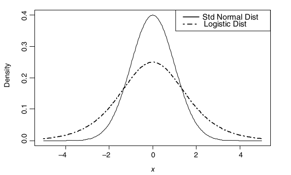

# INTRODUCTION
The distinction between data sample and the underlying data population is always ignored. For instance  the mean concentration of a chemical contaminant  in a soil sample of a contaminated site. Here, the **data sample** is the soil sample that was taken to the laboratory to find out the mean concentration of the contaminant while the **data population** is the entire data population consisting of all possible soil measurements of the chemical contaminant at the site. We need to define some terms to get this clear. 

* **Data Population: ** is the entire set of individuals, items or observations of interest in a study. For instance all the soil samples from the contaminant site.
* **Data Sample: ** is the subset of the population selected for analysis. For example, measuring the height of randomly selected trees in the forest. 
* **Data Distribution: ** describes how data points are spread of arranged. 

**Data Sample vs Data Population**

A deep understanding of the difference between data sample and data population is important in inferential statistics which seeks to generalize the results of data analyses performed on the data samples. A data population consists of all possible observations or data points concerning the characteristic of interest. For instance, when finding out the mean height of all the oak trees in a forest, the data population will be every height of every single oak tree in the forest. 

Contrary, data sample is usually a limited subset of observations drawn for the entire population. In this case we can have a data sample by randomly selecting 100 oak trees and measuring their heights. 

<span style="color: orange;">**Try it!**</span>

Lets simulate data of oak trees with R
```{r}
# Seed for reproducibility
set.seed(123)

# A population of 12500 oak trees 
population_heights <- rnorm(12500, mean = 20, sd=5)
head(population_heights)
```

We have simulated the heights of 12500 oak trees in a forest. The variance `population_heights` represent the data population for the oak tree heights. Lets randomly select 86 trees from the entire data population of oak tree heights

```{r}
# Randomly select 86 trees 
sample_heights <- sample(population_heights, size=86, replace = FALSE)
tail(sample_heights)
```

The variable `sample_heights` represents data sample for the oak tree heights. 

If we make this experiment more interesting, we find the mean and standard deviation for the data population and the data sample for the oak tree heights. Lets do it! 

```{r}
# Mean and standard deviation of the entire population
population_stats <- c(
  Mean = mean(population_heights),
  SD = sd(population_heights)
)

population_stats
```
The entire oak tree data population has a mean height of approximately 20 meters and a standard deviation of approx 5 meters. Lets see how it compares with the data sample of the oak tree heights. 

```{r}
# Mean and standard deviation of the sample
sample_stats <- c(
  Mean = mean(sample_heights),
  SD = sd(sample_heights)
)

sample_stats
```

There is a minor difference between the data sample and the entire data population of the oak tree heights. As you can see the selected sample of oak trees has an average height of 21 meters and a standard deviation of 5.5 meters. 

<span style="color: green;">**Practical Exercise**</span> 

Run the code below to generate the data of soil samples collected in farm with livestock. The main objective was to find the pH of the soil. 

Use the code below to simulate the collection of the data. 
```{r}
# Set seed for reproducibility 
set.seed(76)

# Simulate the data collection
farm_population_pH <- rnorm(n = 5342, mean=3.61, sd=0.8)
head(farm_population_pH)
```

You are required to work on the problems below; 

i. What is the Mean and Standard Deviation of the pH of the entire farm population soil samples. 
ii. Select 65 random samples from the entire population. 
iii. Calculate the Mean and Standard Deviation of the sample. 
iv. How does the Mean and Standard deviation differ from the entire population? 

_______________________________________________________________________
<span style="color: brown;">**Solution**</span> 

Run the code below to generate the data of soil samples collected in farm with livestock. The main objective was to find the pH of the soil. 

Use the code below to simulate the collection of the data. 
```{r}
# Set seed for reproducibility 
set.seed(76)

# Simulate the data collection
farm_population_pH <- rnorm(n = 5342, mean=3.61, sd=0.8)
head(farm_population_pH)
```

You are required to work on the problems below; 

i. What is the Mean and Standard Deviation of the pH of the entire farm population soil samples. 
```{r}
population_stats <- c(
  Mean = mean(farm_population_pH),
  standard_deviation = sd(farm_population_pH)
)

population_stats # show the results
```

ii. Select 65 random samples from the entire population. 
```{r}
farm_sample_pH <- sample(farm_population_pH, 
                         size = 65, 
                         replace = FALSE)
head(farm_sample_pH)
```

iii. Calculate the Mean and Standard Deviation of the sample. 
```{r}
sample_stats <- c(
  Mean = mean(farm_sample_pH),
  standard_deviation = (sd(farm_sample_pH))
)

sample_stats # show the results
```

iv. How does the Mean and Standard deviation differ from the entire population? 

<span style="color: brown;">*The sample mean is slightly higher than the whole population mean while the  standard deviation of the whole populations is almost equal to the data sample's standard deviation*</span>

<span style="color: brown;">**________________________________________________________________________________**</span>


## Data Distributions 

**Data Distribution** describes how data values in data population are spread across the range of possible values. For instance, in our case the height of oak trees in the forest might be distributed normally, meaning that most trees cluster around the average height. Understanding data distribution is crucial in ecological analysis since it helps in; 

- identifying patterns ( for instance seasonal changes in bird populations). 
- choosing appropriate statistical tests. 
- modelling ecological phenomena accurately. 

When dealing with continuous data values like height of oak trees, soil acidity or rainfall, **Probability Distribution Functions** is used to find the likelihood of different outcomes in a population. There are two types of probability distribution functions, namely; 

i. Cumulative distribution function,
ii. Empirical Cumulative distribution function. 

Below is the distribution of oak tree heights represented in a density plot. 
```{r}
library(ggplot2)

# Create a data frame from the data 
oak_df <- data.frame(Height = population_heights)

# Plot the density plot 
ggplot(oak_df, 
       aes(x = Height)) + 
  geom_density(fill = "blue", alpha=0.5) + 
  labs(
    title = "Distribution of tree heights",
    x = "Tree Height(m)",
    y = "Density"
  ) + 
  theme_minimal()
```

Above is the distribution of oak tree heights, lets find its probability using the two types of distribution functions. 

**Cumulative Distribution Function**

This distribution function leans toward that a probability of a random variable is less than or equal to a certain value. 

We can randomly select a sample of heights from a population using the following code:
```{r}
sample_heights <- sample(population_heights, size=86, replace = FALSE)
```

```{r}
tail(sample_heights)
```

For example, if we analyze heights, the CDF could help answer:
*"What percentage of people have a height less than or equal to 170 cm?"*

The CDF of a normal distribution can be visualized using:
```{r}
x <- seq(min(population_heights), max(population_heights), length = 100)
cdf_values <- pnorm(x, mean = mean(population_heights), sd = sd(population_heights))

plot(x, cdf_values, type="l", col="blue", lwd=2, 
     xlab="Height", ylab="Cumulative Probability", 
     main="Cumulative Distribution Function (CDF)")
```

**Empirical Cumulative Distribution Function**

The Empirical Cumulative Distribution Function (ECDF) is a way to estimate the CDF based on the actual observed data (your sample). Instead of assuming a theoretical distribution, it calculates the proportion of values that are less than or equal to each observed value in the sample.

Lets create an ECDF plot in R using the sample heights

```{r}
# calculate CDF 
CDF <- ecdf(sample_heights)

# draw the cdf plot
plot(CDF,
     main="Empirical Cumulative Distribution Function (ECDF)", 
     xlab="Height", ylab="Cumulative Probability", col="red")
```

As you can see, the ECDF graph shows a step-like increase whenever a new height is encountered and the curve provides a data-driven approximation of how heights are distributed in the sample. 

Here are the main differences between CDF(Cumulative Distribution Function) and ECDF(Empirical Cumulative Distribution Function); 

- CDF is based on the entire population while ECDF is based on the observed sample data. 
- The shape of CDF curve is smooth while the ECDF has a step-like plot. 
CDF is used to make model assumptions and probability estimates while ECDF is used to make data driven insights and explanatory analysis. 

<span style="color: green;">**Practical Exercise**</span> 

_______________________________________________________________________
<span style="color: brown;">**Solution**</span> 

<span style="color: brown;">**________________________________________________________________________________**</span>

### Types of Distribution

In statistical tests, it is assumed that the data sample represents the underlying data population. Similarly, the distribution of the data sample is assumed to be similar to the one of the data population. 

These are what characterizes the data distribution; whether the data is; 

- discrete or continuous
- symmetrical or asymmetrical
- bounded by lower and/or upper limits or unbounded. 

Lets discuss different types of data distributions. 

#### Normal distribution 

The normal distribution is a continuous symmetrical distribution in the real number domain (i.e., with the set of possible values ranging between -∞ and ∞) whose probability density function plots as a smooth bell-shaped curve, and whose
cumulative distribution is S-shaped. 

<span style="color: orange;">**Try it!**</span>

To demonstrate this, lets generate 100 random data values with a mean of 5 and a standard deviation of 3. 
```{r}
set.seed(1)

data <- rnorm(100, mean=5, sd=3)
df <- data.frame(data)
# Plot the data
ggplot(df, 
       aes(x = data)) + 
  geom_density(fill = "blue", alpha=0.5) + 
  labs(
    title = "Distribution of data sample",
    x = "Sample Value",
    y = "Density"
  ) + 
  theme_minimal()
```

The data distribution below represents a near bell-shaped curve. 

A normal distribution with a mean of zero and variance of 1 (or
standard deviation of 1, since standard deviation is the square root of variance and square root of 1 is 1) is referred to as a **standard normal distribution**

A standard normal distribution has many applications in statistics such as computation of cumulative probabilities and critical values for hypothesis tests.

<span style="color: orange;">**Try it!**</span> 

Lets generate a random data set that is standardized. 
```{r}
set.seed(100)

data <- rnorm(100, mean=0, sd=1)
df <- data.frame(data)
# Plot the data
ggplot(df, 
       aes(x = data)) + 
  geom_density(fill = "blue", alpha=0.5) + 
  labs(
    title = "Distribution of data sample",
    x = "Sample Value",
    y = "Density"
  ) + 
  theme_minimal()
```

Any data sample that follows a normal distribution can be standardized to a *standard normal distribution* by subtracting its mean from each individual data value and dividing the result by its standard deviation. The resultant values can be referred to as *standard score*, *normal score*, *normal quantile* or *z-value*) 

Here is the formula for calculation the z-value (standardized score); $$z = {{x - \overline x}\over{\sigma}}$$

Where; 

- $x$ is the actual value
- $\overline x$ is the data sample mean 
- $\sigma$ is the standard deviation


<span style="color: orange;">**Try it**</span>

-------------------will generate a data distribution with a known standard deviation and mean then standardize it. Will then plot both samples - raw data and the standardized one----------------------------

<span style="color: orange;">**Example: CUMULATIVE AND EXCEEDANCE PROBABILITIES FOR A NORMAL DISTRIBUTION**</span>

Groundwater Manganese Concentrations in mg/L

______________________**Expand on this**____________________________________


modify the code below to show up the distribution

```
x = seq(0, 0.4, length=100)
y = dnorm(x, 0.52, 0.18)
polygon(c(0, x, 0.4), c(0, y, 0), col = "gray")

# Add a shaded area 
x = seq(1, 0.9, length=25)
y = dnorm(x, 0.52, 0.18)
polygon(c(1, x, 0.9), c(0, y, 0), col = "gray")

```

**Goodness-of-Fit (GOF) Tests for the Normal Distribution**

In parametric statistical tests, it assumed that the data is normally distributed or can be normalized by data transformation such as log transform. The parameters, such as mean and standard deviation, in parametric tests must be specified. 

Verifying the data normality is crucial before conducting the tests. If it fails the test of normality other types of tests(non parametric) are considered. The *GOF* tests are used to access the normality of the data sample which requires 8 to 10 randomly picked data values. 

The tests are; 

- Normal probability plot - also known as normal quantile plot.
- Coefficient of Variation(CV)
- Coefficient of Skewness 
- Shapiro-Wilk(SW) and Shapiro-Francia(SF) procedures
- Filiben's probability plot correlation coefficient (PPCC)
- Shapiro-Wilk multiple group normality

The CV test is the most commonly used method. It is computed simply by dividing the standard deviation by the mean. If the resultant value is greater than 1 then the data fails the normality test, otherwise it passes. $$CV = {\sigma\over{\overline x}}$$

Other GOF tests that are used in testing for normal and other distributions are Anderson–Darling (AD) test and the Lilliefors–Kolmogorov–Smirnov test

The Coefficient of Skewness stated above provides a more direct measure of skewness where skewness of the magnitude of greater than 0.5 is considered moderate to the substantial degree of skewness. 


------------------------------**Add an example**------------------------

**Central Limit Theorem**

____________________simplify it with an example _________________________


#### Lognormal, Gamma, and Other Continuous Distributions 

Before we dive into Gamma distribution, we need to to get the definition of exponential distribution. **Exponential distribution** is the probability of the waiting time between events in a *Poisson Process*.

Imagine you’re analyzing environmental data, such as soil contamination levels or water flow rates. Often, these values are not normally distributed because they can't be negative and tend to have a few extremely high values. This is where the lognormal distribution comes in—it describes data whose logarithms follow a normal distribution. For example, if you take the natural logarithm of highly skewed mercury concentration values, their distribution becomes nearly normal, making statistical analysis easier. However, when back-transforming results, the arithmetic mean can be underestimated, leading to what's called transformation bias—but the median, often equal to the geometric mean, provides a useful estimate. Aside from lognormal, environmental studies frequently rely on other distributions such as gamma, logistic, and uniform, each useful in different scenarios. The gamma distribution, for instance, is often applied to model waiting times or rainfall amounts, offering flexibility through its shape and scale parameters. Understanding these distributions allows us to apply the right statistical methods, improve predictions, and make sense of complex real-world data patterns effectively.

Lets dive deep into each type of the distribution mentioned

**Gamma Distribution** 

Exponential infers the probability until the first event happens while Gamma distribution gives us the probability of the waiting time until the $n^{th}$ event. 

The gamma distribution is bounded by zero on the left (no negative values) and can stretch infinitely to the right, making it suitable for data that exhibit long right tails. It is a powerful tool for modeling real-world data that is positively skewed, such as rainfall amounts, insurance claims, and even environmental contaminant levels. 

When dealing with skewed data, both the **lognormal** and **gamma** distributions are commonly used. However, the gamma distribution has an advantage: it avoids the pitfalls of **transformation bias**, which can arise when converting data back from logarithmic scales to the original scale.

The gamma distribution is controlled by two key parameters:

-  *Shape parameter (k)* – Determines the shape of the distribution. A higher k makes the distribution look more like a normal distribution.
- *Scale parameter (θ)* – Controls the spread or range of the distribution.

Want to see how these parameters influence the distribution? Let’s generate some random data and visualize it!
```{r}
# Load necessary library
library(ggplot2)

# Generate random data from a gamma distribution
set.seed(42)  # Ensures reproducibility
gamma_data <- rgamma(1000, shape = 5, scale = 2)

# Visualize the data distribution
ggplot(data.frame(gamma_data), aes(x = gamma_data)) +
  geom_histogram(binwidth = 2, fill = "skyblue", color = "black", alpha = 0.7) +
  ggtitle("Histogram of Gamma-Distributed Data") +
  xlab("Values") + ylab("Frequency") +
  theme_minimal()
```

<span style="color: orange;">**Try it**</span>

Try tweaking the shape and scale values in the code above to see how they affect the distribution.

- Increase the shape parameter (k) to see how the distribution approaches normality.
- Reduce the scale parameter (θ) to create a sharper peak.

Want to check if your data follows a gamma distribution? You can perform Goodness-of-Fit (GOF) tests using the `fitdistrplus` package in R.

The package is installed by: 
```
install.packages("fitdistrplus")
```

```{r}
library(fitdistrplus)

# Fit a gamma distribution to the data
fit <- fitdist(gamma_data, "gamma")

# Print summary of the fit
summary(fit)
```

The gamma distribution is an excellent choice for modeling skewed data, offering flexibility and reliable statistical methods without the transformation bias of lognormal distributions. By experimenting with different parameters and visualizing the results, you can better understand its applications in environmental science, finance, and beyond!

<span style="color: green;">**Practical Exercise**</span> 

_______________________________________________________________________
<span style="color: brown;">**Solution**</span> 

<span style="color: brown;">**________________________________________________________________________________**</span>


**Logistic Distribution** 

The logistic distribution, like the normal distribution, is symmetric and unbounded. However, it differs in having **fatter tails**, meaning it contains more extreme values on both sides. This makes it useful in various fields, such as:

- *Logistic regression*, where it models binary outcomes (e.g., success/failure).
- *Ecological modeling*, where population growth follows an S-shaped logistic curve.
- *Machine learning*, for classification problems.

The image below shows the slight difference between the logistic and normal distribution


Here are the key characteristics of lognormal distribution;

- *Symmetry:* Centered around a location parameter (mean).
- *Scale Parameter:* Determines the spread, similar to the standard deviation in normal distribution.
- *Fat Tails:* Greater occurrence of extreme values compared to the normal distribution.

The cumulative distribution function (CDF) of the logistic distribution resembles the logistic function:
$${P(t)}={{e^t}\over{1 + e^t}}$$
In logistic regression, the probability of success is expressed as: 
$${\pi(x)}={{e^{(b_0 +b_1x)}}\over{1+e^{(b_0+b_1x)}}}$$
The *logit function*, which serves as the response variable in logistic regression, defined as; 
$${log({{\pi(x)}\over{1-\pi(x)}})}={b_0 + b_1x}$$

<span style="color: orange;">**Try it**</span> 

Let’s generate some logistic-distributed data and compare it with the normal distribution to understand their differences.

The below one is a logistic distribution
```{r}
# Load necessary library
library(ggplot2)

# Generate random data from the logistic distribution
set.seed(42)  # Ensures reproducibility
logistic_data <- rlogis(1000, location = 0, scale = 1)

# Visualize the data distribution
ggplot(data.frame(logistic_data), aes(x = logistic_data)) +
  geom_histogram(binwidth = 0.5, fill = "lightcoral", color = "black", alpha = 0.7) +
  ggtitle("Histogram of Logistic-Distributed Data") +
  xlab("Values") + ylab("Frequency") +
  theme_minimal()
```

Now let's compare their probability density functions (PDFs).
```{r}
# Define x-axis range
x <- seq(-5, 5, length.out = 300)

# Compute density for normal and logistic distributions
normal_density <- dnorm(x, mean = 0, sd = 1)
logistic_density <- dlogis(x, location = 0, scale = 1)

# Plot the distributions
plot(x, normal_density, type = "l", lwd = 2, col = "blue", 
     ylab = "Density", xlab = "x", main = "Normal vs Logistic Distribution")
lines(x, logistic_density, lwd = 2, col = "red", lty = 2)
legend("topright", legend = c("Normal Distribution", "Logistic Distribution"),
       col = c("blue", "red"), lty = c(1, 2), lwd = 2)
```

 You can try experiment with different location and scale parameters in the above code to see how the logistic distribution changes. Location is changes to shift the distribution left and right while the scale is increased to make the distribution spread out more. 
 
Want to see logistic regression in action? Here's a quick example of modeling a binary outcome.
```{r}
# Simulating data
set.seed(42)
x <- rnorm(100)
y <- rbinom(100, 1, plogis(0.5 + 1.2 * x))  # Logistic function

# Fit logistic regression
logistic_model <- glm(y ~ x, family = binomial)

# Summary of model
summary(logistic_model)
```

The logistic distribution is a powerful tool for modeling data with skewed distributions and binary outcomes. Understanding its properties, generating data, and visualizing it interactively can provide valuable insights, especially in fields like statistics, machine learning, and population modeling.

<span style="color: green;">**Practical Exercise**</span> 

_______________________________________________________________________
<span style="color: brown;">**Solution**</span> 

<span style="color: brown;">**________________________________________________________________________________**</span>


- **Other Continuous Distributions** 

Other types of continuous distributions include;

- *Uniform distribution:* is appropriate when the only available data consists of the minimum value  and maximum value . All values within this range have an equal probability of occurring, meaning the probability density function (PDF) is constant at  within the interval , and zero elsewhere.
- *Triangular distribution:* is suitable when the minimum value , maximum value , and most likely value  are known. This distribution assumes that values increase linearly from  to the peak , and then decrease linearly to. 
```
install.packages("triangle")
library(triangle)
```

- *Extreme Value distributions:* Extreme value distributions model the smallest or largest values in a dataset. A common example is analyzing annual peak streamflow rates at a monitoring station to estimate flood magnitudes expected within a specific period (e.g., 50-year or 100-year floods).

One commonly used extreme value distribution is the Log-Pearson Type III distribution, which is right-skewed and bounded on the left by zero (since negative values are not possible). This distribution is widely used in flood frequency analysis and is related to the gamma distribution.

For analyzing low flow values, distributions such as the Weibull and Gumbel distributions are commonly employed. These distributions are particularly useful for estimating probabilities of extreme low flow conditions over time.


<span style="color: orange;">**Try it!**</span> 


<span style="color: green;">**Practical Exercise!**</span> 

_______________________________________________________________________
<span style="color: brown;">**Solution**</span> 

<span style="color: brown;">**________________________________________________________________________________**</span>


#### Distributions Used in Inferential Statistics 

When the sample size is large (typically ≥30) and the data are not highly skewed (skewness coefficient ≤ 0.5 or 1), the **central limit theorem** allows for approximate normality, enabling extrapolations from sample statistics to population parameters. However, for smaller samples—common in environmental data—or when the population standard deviation is unknown, **exact sampling theory** is preferred, leading to the use of distributions like **Student’s t, chi-square**, and **F distributions**. These distributions are essential for **statistical inference**, including confidence interval estimation, hypothesis testing for population means, and significance tests for regression coefficients.

##### **Student’s t Distribution**

This type of distribution is essential for inference when the population standard deviation is unknown. The t-distribution is used for hypothesis testing, confidence intervals, and regression analysis, among other applications.

Given a random sample $x_1,x2,...,x_n$ from a normal distribution with an unknown mean  and standard deviation , the t-statistic is given by:
$$t = {{x-\overline X}\over{s/\sqrt n}}$$
Where:

- $x$ is the new observation
- $\overline X$ is the sample mean 
- $s$ is the sample standard deviation 
- $n$ is the sample size 

It can be used in ecology to;

- Compare species populations -- if the two populations have the same mean 
- Assessing biodiversity changes -- like before and fater habitat restoration differs significantly
- Analyzing environmental variables -- like poullution levels between two forests areas differs. 

<span style="color: orange;">**Try it!**</span> 

We will investigate difference in tree heights in a forested area. 

- Generationg and plotting t-distribution
```{r}
# Load necessary library
library(ggplot2)

# Define x values
t_values <- seq(-4, 4, length=100)

# Compute density for different degrees of freedom
df2 <- dt(t_values, df=2)
df12 <- dt(t_values, df=12)
norm <- dnorm(t_values) # Standard normal

data <- data.frame(x=t_values, StdNormal=norm, df2=df2, df12=df12)

# Plot the distributions
ggplot(data, aes(x=x)) +
  geom_line(aes(y=StdNormal, linetype="Std Normal")) +
  geom_line(aes(y=df2, linetype="t, df = 2")) +
  geom_line(aes(y=df12, linetype="t, df = 12")) +
  labs(y="Probability Density", x="t values") +
  scale_linetype_manual("", values=c("solid", "dashed", "dotdash")) +
  theme_minimal()
```

- Perform two sample t-test 
```{r}
# Sample data (species richness in two forest areas)
area_A <- c(23, 25, 27, 30, 28, 26, 29, 31)
area_B <- c(19, 20, 22, 24, 21, 23, 22, 25)

# Perform two-sample t-test
t.test(area_A, area_B, var.equal=TRUE)
```

Lets now visualize the critical regions in the t-distributions 
```{r}
# Define x values
x_vals <- seq(-4, 4, length=200)
y_vals <- dt(x_vals, df=10)

# Critical region (alpha = 0.05, two-tailed)
critical_val <- qt(0.975, df=10)

# Plot
plot(x_vals, y_vals, type="l", ylab="Probability Density", xlab="t values", main="t-Distribution with Critical Regions")
abline(v=c(-critical_val, critical_val), col="red", lwd=2, lty=2)
```

This will help you with the interpretation 

- Compares the t-distribution with different degrees of freedom to the normal distribution. The t-distribution has heavier tails for small degrees of freedom.
- One-Sample t-Test: Tests if the mean tree height significantly differs from 14m.
- Two-Sample t-Test: Tests if species richness significantly differs between two areas.
- Critical Region Visualization: Shows rejection regions for hypothesis testing.


<span style="color: green;">**Practical Exercise**</span> 


_______________________________________________________________________
<span style="color: brown;">**Solution**</span> 

<span style="color: brown;">**________________________________________________________________________________**</span>


- Chi-Square Distribution
- F Distribution

#### Dicrete Distributions 

- Binomial Distribution
- Poisson Distribution 


## <span style="color: green;">**Hands-on Exercises**</span> 

_______________________________________________________________________
<span style="color: brown;">**Solution**</span> 

<span style="color: brown;">**________________________________________________________________________________**</span>